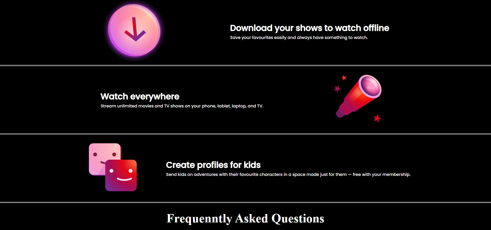
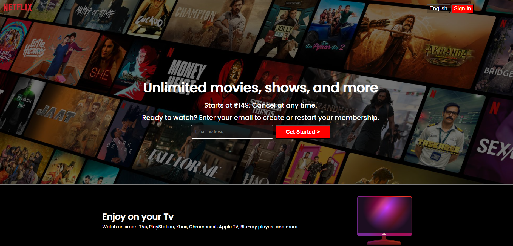

# 🎬 Netflix Clone Website

A responsive **Netflix Clone website** built using **HTML** and **CSS**.  
This project replicates the **UI and layout of Netflix’s homepage**, focusing on modern design, responsiveness, and front-end development fundamentals.

---

## 🚀 Features

- 🎥 Netflix-style **hero section with background banner**
- 📺 Movie/TV show sections with grid layout  
- 📱 Fully **responsive design** (Desktop + Mobile)  
- 🎨 Clean dark UI inspired by Netflix  
- ⚡ Lightweight (Pure HTML & CSS — No frameworks)

---

## 🧠 Tech Stack

| Technology | Description |
|------------|------------|
| **HTML5** | Page structure and layout |
| **CSS3** | Styling, Flexbox, Grid, responsiveness |

---

## 🖼️ Preview

---

## 🔗 Live Link

Check out the live version of my Netflix Clone here:  
👉 **[Visit Netflix Clone](https://adityamahekar.github.io/Netflix_Clone/)**

---

## 📌 Note

This project is created **only for learning and practice purposes**.  
All design inspiration belongs to **Netflix**.
